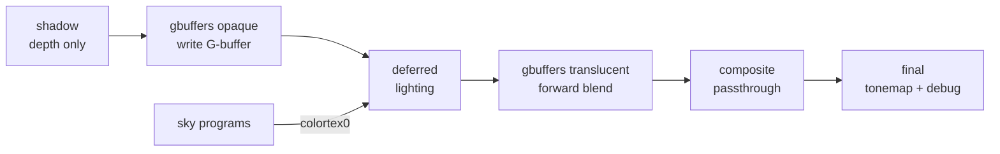

# Asteria Loom — Architecture Overview

A contributor-facing map of how the pack is put together. It reflects the **Phase 1**
pipeline. The binding, detailed specification is the Phase 1 contract; read both:

- [`docs/architecture/phase1-contract.md`](architecture/phase1-contract.md) — the LOCKED
  Phase 1 contract (authoritative for buffers, program set, and conventions).
- [`docs/brief.md`](brief.md) — the full product brief and roadmap.

## Pass chain (Phase 1)

Iris runs a fixed sequence of passes each frame. Phase 1 uses the following subset:

```
setup*  →  shadow  →  gbuffers (opaque)  →  deferred  →  gbuffers (translucent)  →  composite  →  final
           depth-only   write G-buffer      lighting      forward-blend on top       passthrough    tonemap
```

- **setup** — reserved; no Phase 1 work here.
- **shadow** — depth-only render into the shadow map (cutout alpha only). No distortion yet.
- **gbuffers (opaque)** — terrain, entities, block, hand, basic, textured, textured_lit,
  particles. These do **no lighting**; they write the G-buffer. Sky programs
  (skybasic, skytextured, clouds) instead write scene color directly to colortex0.
- **deferred** — fullscreen. Reads the G-buffer and shadow map, applies the Phase 1
  lighting model, writes lit color to colortex0. Sky pixels (depth == 1.0) pass through.
- **gbuffers (translucent)** — water, hand_water, weather. Forward-lit with the same
  lighting library, blended on top of colortex0.
- **composite** — structural passthrough of colortex0. Intentionally cheap; kept so the
  pass-chain shape stays stable as Phases 2–4 fill it in.
- **final** — exposure → placeholder filmic tonemap → linear-to-sRGB → optional debug view.
  Holds the canonical buffer-format `const` block.



## G-buffer layout (Phase 1)

Mirrors §3 of the Phase 1 contract. Stay within colortex0–3.

| Buffer | Format | Contents | Cleared |
|---|---|---|---|
| colortex0 | RGBA16F | HDR scene color (sky, then lit scene from deferred, then translucents/weather blended on top) | yes (0,0,0,0) |
| colortex1 | RGBA8 | G-buffer: `albedo.rgb`, `a` = vanilla AO / spare | yes |
| colortex2 | RGBA16 | G-buffer: octahedral normal in `.rg`, lightmap (block, sky) in `.ba` | yes |
| colortex3 | RGBA8 | G-buffer: `r` = material ID / 255, `g` = flag bits (see `encoding.glsl`), `ba` spare | yes |

Depth: depthtex0/1 as usual. Shadow: shadowtex0/1 (shadowcolor0 is declared for Phase 2,
unused now). Opaque gbuffers write `RENDERTARGETS: 1,2,3`; sky, deferred, translucent, and
composite write `RENDERTARGETS: 0`.

Buffer-format `const` declarations and `shadowMapResolution` live in **exactly one place**,
`final.fsh` (a comment/`const` block near the top). They appear nowhere else.

## Where things live

```
shaders/
├── shaders.properties      # profiles, screens, buffer/feature config
├── settings.glsl           # every tunable + color-identity constants; included everywhere
├── lang/en_us.lang         # option/value/profile/screen labels
├── lib/                    # shared includes only (no programs)
│   ├── common.glsl         # constants, small helpers, debug plumbing
│   ├── encoding.glsl       # octahedral normal encode/decode, material-ID pack
│   ├── color.glsl          # sRGB<->linear, luminance, tonemap placeholder
│   ├── lighting.glsl       # Phase 1 lighting model (deferred + translucent forward share it)
│   ├── shadow.glsl         # shadow-space transforms, provisional sampling
│   └── space.glsl          # screen<->view<->world transforms
├── shadow.vsh/.fsh
├── gbuffers_*.vsh/.fsh
├── deferred.vsh/.fsh
├── composite.vsh/.fsh
└── final.vsh/.fsh
```

- **`settings.glsl`** is the single source of truth for tunables and the color identity
  (warm sun tint, cool ambient tint, torch color, night floor). Options use the
  `#define X 4 // [1 2 4 8]` syntax so Iris builds the GUI.
- **`shaders.properties`** holds the five profiles, the settings screens, and buffer/feature
  declarations. Every option in `settings.glsl` appears in exactly one screen.
- **`lib/`** holds shared includes only — no programs. Each file has an include guard
  (`#ifndef AL_LIB_X …`). The lighting model is kept in `lib/lighting.glsl` so the forward
  translucent passes reuse the exact same math as deferred.

## Conventions

- Every program begins `#version 330 compatibility` and `#include "/settings.glsl"`.
- Pack-internal macros are prefixed `AL_`; user-facing options are named plainly (e.g.
  `SHADOWS`).
- `RENDERTARGETS` comments use the modern `/* RENDERTARGETS: N,M */` form and match the
  `out vecN outK;` declaration order exactly.

## macOS GL 4.1 constraint summary

macOS is **OpenGL 4.1 core, permanently**. This shapes the entire design:

- **Unavailable on Mac at any cost:** compute shaders, SSBOs, image load/store, and atomic
  counters (all GL 4.2/4.3 features). Tessellation (4.0) is available.
- **Hard limit of 16 active fragment samplers per program.** Every program file carries a
  comment stating its sampler count; Phase 1 programs stay at ≤8.
- **Nothing beyond GLSL 3.30 syntax** in any file: no `packUnorm2x16` / `packHalf2x16`
  (GLSL 4.00+), no explicit binding/location layout qualifiers on samplers/uniforms, no
  compute/SSBO/image syntax anywhere. Manual bit packing is done with float math.

### Advanced-tier gating plan (`AL_ADVANCED_TIER`)

The single-codebase mechanism: `shaders.properties` opts into Iris feature flags

```
iris.features.optional = COMPUTE_SHADERS SSBO CUSTOM_IMAGES SEPARATE_HARDWARE_SAMPLERS
```

and a shared macro is defined only when the machine can support GL 4.3+ compute work and
is not macOS:

```glsl
#if defined IRIS_FEATURE_COMPUTE_SHADERS && defined IRIS_FEATURE_SSBO \
    && defined IRIS_FEATURE_CUSTOM_IMAGES && !defined MC_OS_MAC
    #define AL_ADVANCED_TIER
#endif
```

All advanced-tier programs, samplers, and declarations (Phase 6: flood-fill colored voxel
light, voxel RT shadows/GI, histogram exposure, 3D-cached volumetrics) are gated behind
`AL_ADVANCED_TIER`. The Mac build must never even *see* GL 4.2+ syntax. Nothing in Phase 1
uses these flags; they are declared now purely for future-proofing.

## `worldN` migration note (Phase 5)

Phase 1 uses **no `worldN` folders**, so shaders load from the pack root for every
dimension. This is deliberate: once *any* `worldN` folder exists, Iris loads shaders **only**
from `worldN` folders. Phase 5 introduces `world0` (Overworld), `world-1` (Nether), and
`world1` (End, home of the black-hole sky) together, migrating each program via a 2-line
`#include` shim so the shared source stays in one place. Do not add a world folder before
then.
