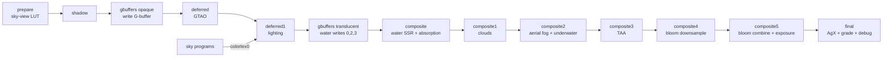

# Asteria Loom — Architecture Overview

A contributor-facing map of how the pack is put together. It reflects the pipeline **as of
Phase 5** (Phases 1–5 shipped; the pack is in the 5.x visual-fix / tuning pass). Each phase
has a binding contract; read the relevant one plus the brief:

- [`docs/architecture/phase1-contract.md`](architecture/phase1-contract.md) — scaffold,
  conventions, base G-buffer (authoritative for the layout and Mac-safe GLSL rules).
- [`docs/architecture/phase2-contract.md`](architecture/phase2-contract.md) — shadows + GTAO.
- [`docs/architecture/phase3-contract.md`](architecture/phase3-contract.md) — atmosphere,
  clouds, fog, sky-view LUT.
- [`docs/architecture/phase4-contract.md`](architecture/phase4-contract.md) — water, TAA,
  bloom, AgX + grading (authoritative for the current pass chain and buffers 8–9).
- [`docs/brief.md`](brief.md) — the full product brief and roadmap.

## Pass chain (current, Phase 4)

Iris runs a fixed sequence of passes each frame. The current chain:

```
prepare → shadow → gbuffers(opaque) → deferred → deferred1 → gbuffers(translucent)
  → composite → composite1 → composite2 → composite3 → composite4 → composite5 → final
```

- **prepare** — bakes the sky-view LUT tile (atmosphere) into colortex6, once per frame.
- **shadow** — depth-only render into the (distortion-warped) shadow map, cutout alpha only.
- **gbuffers (opaque)** — terrain, entities, block, hand, basic, textured, textured_lit,
  particles. These do **no lighting**; they write the G-buffer. Sky programs (skybasic,
  skytextured, clouds) instead write scene colour directly to colortex0.
- **deferred** — GTAO: horizon-based AO from depth + normal, temporally blended against the
  colortex5 history. Writes the current-frame AO to colortex4. Gated on `AO` (Potato/Low skip it).
- **deferred1** — the main lighting pass: PCSS shadows + contact shadows + hemisphere ambient
  + warm blocklight, consuming the G-buffer, shadow textures, sky LUT and AO. Writes colortex0.
- **gbuffers (translucent)** — water, hand_water, weather, translucent entities, forward-lit
  and blended onto colortex0. `gbuffers_water` **also** re-writes surface normal/lightmap
  (colortex2) and material ID (colortex3) so the water composite can find it.
- **composite** — water effects: SSR on water/ice pixels + Beer-Lambert absorption tint of the
  submerged scene + projected caustics.
- **composite1** — volumetric clouds raymarch + temporal blend; keeps the AO-history and
  cloud-history copies (writes colortex0, 5, 7).
- **composite2** — aerial-perspective fog, plus the underwater-medium branch when the eye is
  submerged. Gated on `AERIAL_FOG`.
- **composite3** — TAA resolve: reproject + neighbourhood clamp; writes colortex0 and the
  TAA history colortex8.
- **composite4** — bloom downsample tile chain into the colortex9 atlas. Gated on `BLOOM`.
- **composite5** — bloom upsample/combine into the scene, and writes the adapted-exposure
  value back into colortex5's spare alpha at texel (0,0).
- **final** — mip-average auto-exposure → AgX tonemap → biome/weather grade → linear-to-sRGB
  → optional debug view. Holds the canonical buffer-format `const` block.



## Buffer layout (current)

colortex0–3 hold the scene colour and G-buffer; colortex4–9 hold effect state and temporal
histories. Formats come from the Phase 1–4 contracts.

| Buffer | Format | Contents | Cleared |
|---|---|---|---|
| colortex0 | RGBA16F | HDR scene colour (sky → lit scene → translucents → water/clouds/fog/TAA/bloom) | yes (0,0,0,0) |
| colortex1 | RGBA8 | G-buffer: `albedo.rgb`, `a` = vanilla AO / spare | yes |
| colortex2 | RGBA16 | G-buffer: octahedral normal in `.rg`, lightmap (block, sky) in `.ba`; water surface re-writes this | yes |
| colortex3 | RGBA8 | G-buffer: `r` = material ID / 255, `g` = flag bits (see `encoding.glsl`), `ba` spare; water re-writes matID | yes |
| colortex4 | RG16F | Current-frame GTAO: `r` = AO term, `g` = temporal confidence | yes |
| colortex5 | RGBA16F | AO history (`r` AO, `g` confidence, `b` linear depth); `a` at texel (0,0) = adapted exposure | **no** |
| colortex6 | RGBA16F | Sky-view LUT tile (top-left 256×128 = lat-long sky radiance; read via `alSkySample(dir)`) | **no** |
| colortex7 | RGBA16F | Cloud history: `rgb` = in-scattered radiance, `a` = transmittance | **no** |
| colortex8 | RGBA16F | TAA history: `rgb` = resolved colour, `a` = blend confidence | **no** |
| colortex9 | RGBA16F | Bloom mip atlas (6 levels packed as tiles; layout in `lib/bloom.glsl`) | yes |

Depth: depthtex0/1 as usual. Shadow: shadowtex0/1 (plain depth textures — the software
compare path). The persistent (`clear=false`) buffers 5–8 rely on **NaN-proof
range-validated reads** so an undefined first frame self-heals; this is a standing law of the
pack, not an optional nicety.

Buffer-format `const` declarations and `shadowMapResolution` live in **exactly one place**,
`final.fsh` (a comment block near the top — the format tokens are Iris-only and would not
compile as live GLSL). They appear nowhere else.

## Where things live

```
shaders/
├── shaders.properties      # profiles, screens, buffer/feature/clear config
├── settings.glsl           # every tunable + color-identity constants; included everywhere
├── lang/en_us.lang         # option/value/profile/screen labels
├── lib/                    # shared includes only (no programs)
│   ├── common.glsl         # constants, small helpers, debug plumbing
│   ├── encoding.glsl       # octahedral normal encode/decode, material-ID pack
│   ├── color.glsl          # sRGB<->linear, luminance helpers
│   ├── space.glsl          # screen<->view<->world transforms, reprojection helpers
│   ├── lighting.glsl       # lighting model (deferred1 + translucent forward share it)
│   ├── shadow.glsl         # shadow-space distortion transforms, PCSS/contact sampling
│   ├── contact.glsl        # screen-space contact-shadow raymarch
│   ├── atmosphere.glsl     # sky-view LUT baking + alSkyMapUV/alSkySample helpers
│   ├── atmosphere_common.glsl
│   ├── clouds.glsl         # volumetric cloud raymarch
│   ├── clouds_common.glsl
│   ├── nightsky.glsl       # stars, galaxy band, shooting stars
│   ├── fog.glsl            # aerial-perspective fog + optical-depth model
│   ├── water.glsl          # ripples, SSR, absorption, caustics, underwater media (Phase 4)
│   ├── jitter.glsl         # Halton TAA jitter (Phase 4)
│   ├── bloom.glsl          # bloom tile-atlas layout + UV helpers (Phase 4)
│   ├── tonemap.glsl        # AgX fit (Phase 4)
│   └── grade.glsl          # biome-adaptive grading + weather storytelling (Phase 4)
├── prepare.vsh/.fsh        # sky-view LUT
├── shadow.vsh/.fsh
├── gbuffers_*.vsh/.fsh     # full opaque + translucent set (incl. entities_translucent)
├── deferred.vsh/.fsh       # GTAO
├── deferred1.vsh/.fsh      # lighting
├── composite.vsh/.fsh      # water FX
├── composite1..5.vsh/.fsh  # clouds, fog, TAA, bloom down, bloom combine
└── final.vsh/.fsh          # AgX + grade + debug
```

- **`settings.glsl`** is the single source of truth for tunables and the color identity
  (warm sun tint, cool ambient tint, torch color, night floor). Options use the
  `#define X 4 // [1 2 4 8]` syntax so Iris builds the GUI.
- **`shaders.properties`** holds the five profiles, the settings screens, and buffer/feature
  declarations. Every option in `settings.glsl` appears in exactly one screen.
- **`lib/`** holds shared includes only — no programs. Each file has an include guard
  (`#ifndef AL_LIB_X …`). The lighting model is kept in `lib/lighting.glsl` so the forward
  translucent passes reuse the exact same math as the `deferred1` lighting pass.

## Conventions

- Every program begins `#version 330 compatibility` and `#include "/settings.glsl"`.
- Pack-internal macros are prefixed `AL_`; user-facing options are named plainly (e.g.
  `SHADOWS`).
- `RENDERTARGETS` comments use the modern `/* RENDERTARGETS: N,M */` form and match the
  `out vecN outK;` declaration order exactly.

## macOS GL 4.1 constraint summary

macOS is **OpenGL 4.1 core, permanently**. This shapes the entire design:

- **Unavailable on Mac at any cost:** compute shaders, SSBOs, image load/store, and atomic
  counters (all GL 4.2/4.3 features). Tessellation (4.0) is available.
- **Hard limit of 16 active fragment samplers per program.** Every program file carries a
  comment stating its sampler count; the validator enforces the budget across all profiles.
- **Nothing beyond GLSL 3.30 syntax** in any file: no `packUnorm2x16` / `packHalf2x16`
  (GLSL 4.00+), no explicit binding/location layout qualifiers on samplers/uniforms, no
  compute/SSBO/image syntax anywhere. Manual bit packing is done with float math.

### Advanced-tier gating plan (`AL_ADVANCED_TIER`)

The single-codebase mechanism: `shaders.properties` opts into Iris feature flags

```
iris.features.optional = COMPUTE_SHADERS SSBO CUSTOM_IMAGES SEPARATE_HARDWARE_SAMPLERS
```

and a shared macro is defined only when the machine can support GL 4.3+ compute work and
is not macOS:

```glsl
#if defined IRIS_FEATURE_COMPUTE_SHADERS && defined IRIS_FEATURE_SSBO \
    && defined IRIS_FEATURE_CUSTOM_IMAGES && !defined MC_OS_MAC
    #define AL_ADVANCED_TIER
#endif
```

All advanced-tier programs, samplers, and declarations (Phase 6: flood-fill colored voxel
light, voxel RT shadows/GI, histogram exposure, 3D-cached volumetrics) are gated behind
`AL_ADVANCED_TIER`. The Mac build must never even *see* GL 4.2+ syntax. Nothing through
Phase 4 uses these flags; they are declared now purely for future-proofing.

## `worldN` migration note (Phase 5)

The pack still uses **no `worldN` folders**, so shaders load from the pack root for every
dimension. This is deliberate: once *any* `worldN` folder exists, Iris loads shaders **only**
from `worldN` folders. Phase 5 introduces `world0` (Overworld), `world-1` (Nether), and
`world1` (End, home of the black-hole sky) together, migrating each program via a 2-line
`#include` shim so the shared source stays in one place. Do not add a world folder before
then.
